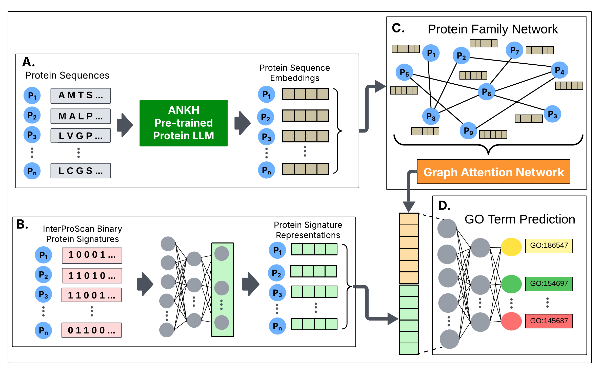

[](https://hits.sh/github.com/bozdaglab/ProtFun/)


## ProtFun: A Protein Function Prediction Model Using Graph Attention Networks with a Protein Large Language Model




## ProtFun

We propose a multi-modal deep learning architecture called **ProtFun** to predict protein functions. ProtFun
integrates protein large language model (LLM) embeddings as node features in a protein family network. Employing a
graph attention network (GAT) on this protein family network, ProtFun learns protein embeddings, which are integrated
with protein signature representations from InterPro to train a protein function prediction model. We evaluated our
architecture using two benchmark datasets.

## How to Run ProtFun

1. **Generate Sequence-Based Embeddings**  
   Protein embeddings were generated using [ANKH](https://github.com/agemagician/Ankh) LLM using protein sequences.

   -[Run Notebook: 01_LLM_embeddigns.ipynb](Notebooks/01_LLM_embeddigns.ipynb)

2. **Binary Vector Representation of Proteins**  
   Binary protein vector representations were generated based on [InterPro](https://github.com/ebi-pf-team/interproscan) signatures for each protein.

    -[Run Notebook: 02_Binary_protein_signatures.ipynb](Notebooks/02_Binary_protein_signatures.ipynb)

3. **ProtFun Evaluation and Results**

    We constructed a protein family network where node (protein) features [(Step 1: Sequence-Based Embeddings)](Notebooks/01_LLM_embeddigns.ipynb) were obtained from a protein LLM.
    Applying GAT on this network, we learned protein embeddings, which were concatenated with the latent representation of protein signatures [(Step 2: Binary Vector Representation)](Notebooks/02_Binary_protein_signatures.ipynb) from InterPro to train a protein function prediction model. 
    
    The performance of **ProtFun** in predicting MFO, BPO, and CCO terms on DeepGOZero dataset as follows:
    
    - [MFO Evaluation: mf.ipynb](Notebooks/mf.ipynb)
    - [BPO Evaluation: bp.ipynb](Notebooks/bp.ipynb)
    - [CCO Evaluation: cc.ipynb](Notebooks/cc.ipynb)

## Datasets

The datasets are available in the [datasets](datasets) folder for direct access. They were obtained from [deepgozero](https://deepgo.cbrc.kaust.edu.sa/data/deepgozero/) repository. 

## Installation Guide

The environment.yml file and requirements.txt are provided in the main repository for your convenience.

The provided `environment.yml` file can be used to create the required Conda environment as follows:
```bash
conda env create -f environment.yml
conda activate prot_fun


     

